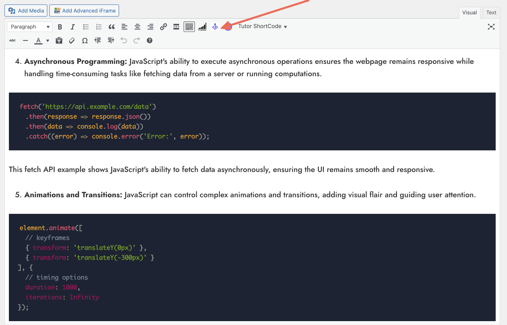
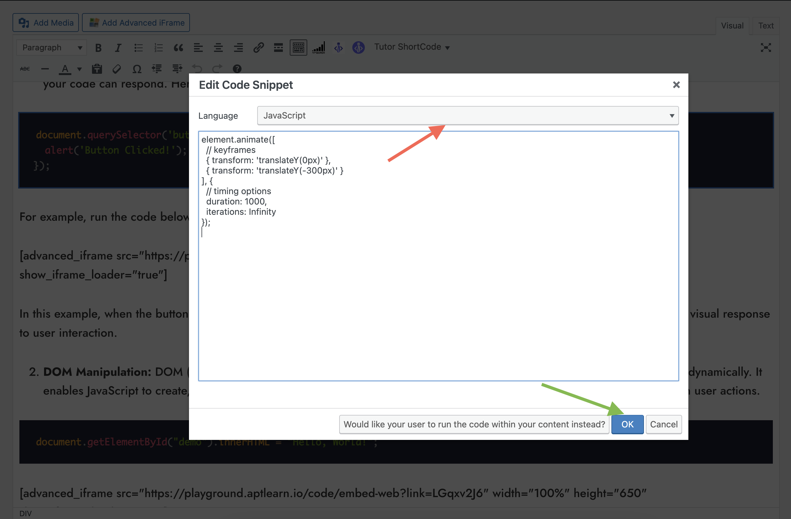
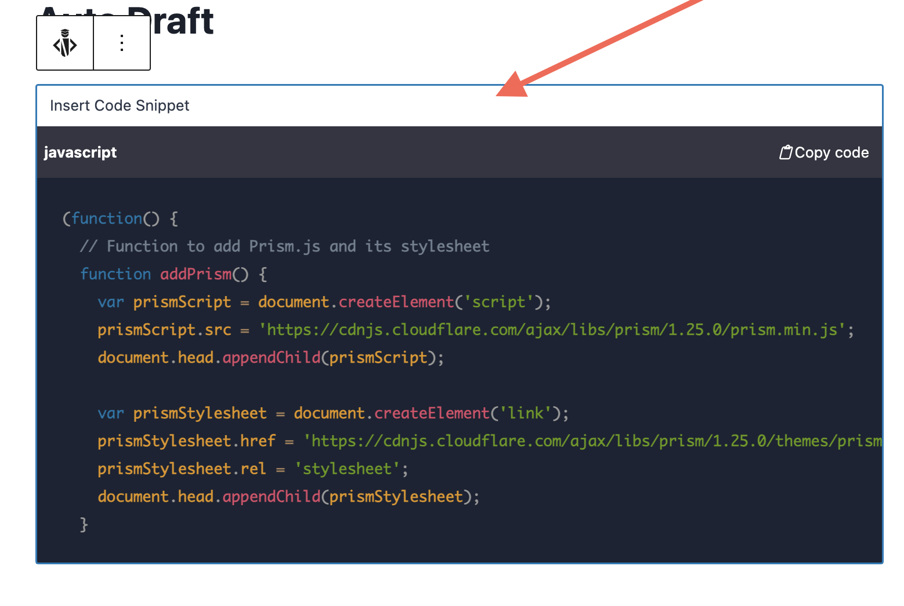
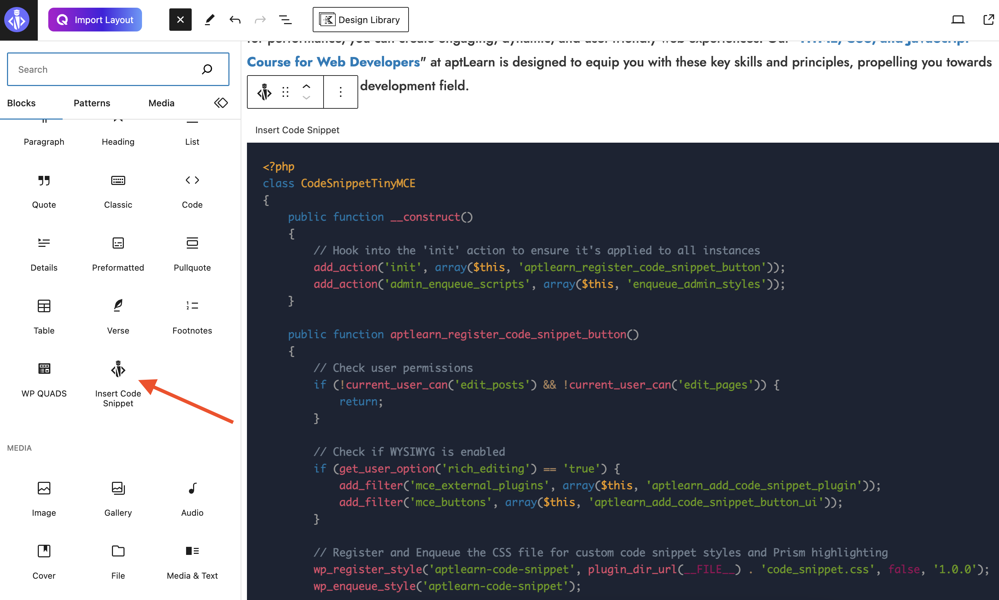
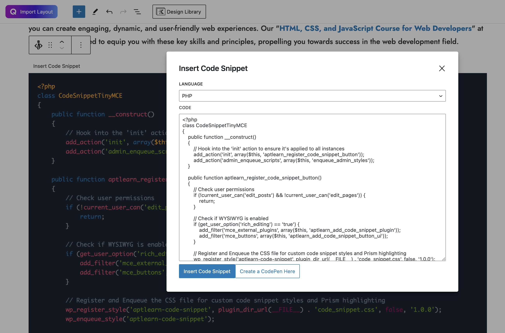
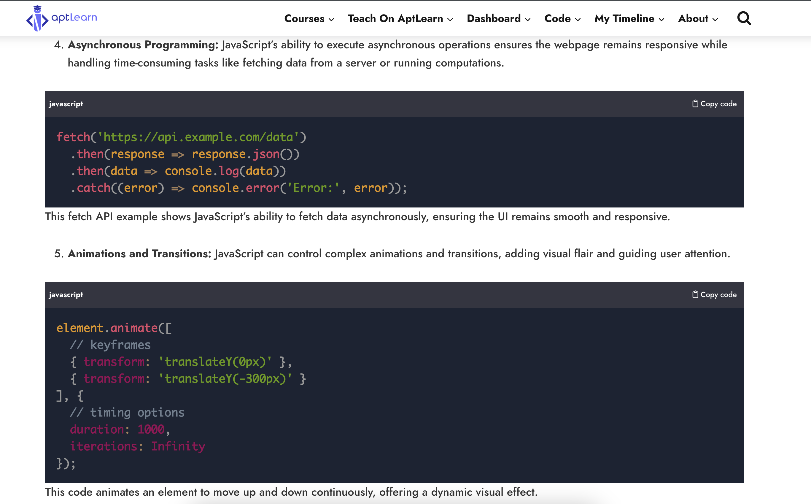
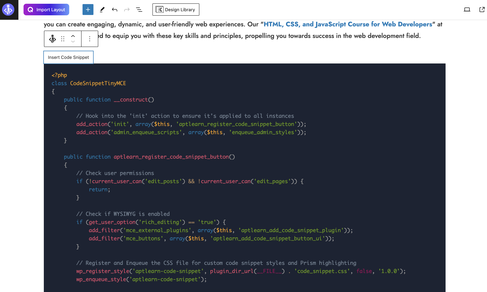

# Advanced Code Beautifier

Elevate your code snippets into visually stunning masterpieces with Advanced Code Beautifier! Ideal for developers, bloggers, educators, and anyone who wants to present code beautifully on their WordPress site.


## Table of Contents
- [Features](#-Features)
- [Installation](#installation)
- [Configuration](#-configuration)
- [Guide for Usage in Classic Editor](#%EF%B8%8F-guide-for-usage-in-classic-editor)
- [Support](#-support)
- [Contributions](#-contributions)
- [License](#-license)
- [Developer Guide](#-developer-guide)
  - [Directory Structure](#directory-structure)
  - [Frontend](#frontend)
  - [Code Snippet](#code-snippet)
  - [Block Editor Compatibility](#block-editor-compatibility)
  - [Extending and Contributing](#extending-and-contributing)
  - [Extending the Plugin](#extending-the-plugin)
- [Changelog](#changelog)
- [Credits](#-credits)


### 🎨 Features
- **Syntax Highlighting**: 🌈 Supports multiple programming languages, with vibrant syntax highlighting.
- **Block Editor Compatibility**: 🧩 Seamless integration with TinyMCE and WordPress block editors.
- **Code Copying**: 📋 One-click code copying for your readers.
- **Custom Styling**: 💅 Adjust the appearance to match your website's aesthetics.
- **Readability Focus**: 👓 Designed for maximum code clarity and readability.
- **And More!**: ✨ Discover additional features within!

### Installation
1. Download the plugin [here]([link-to-plugin](https://akinolaakeem.com/wp-content/uploads/2023/08/codesnippet-1.zip)).
2. Navigate to 'Plugins > Add New' in your WordPress dashboard.
3. Click 'Upload Plugin', choose the downloaded file, then click 'Install Now'.
4. Activate and enjoy!

### 🔧 Configuration
Navigate to the dedicated settings page to customize the plugin. Adjust syntax highlighting themes, enable/disable certain features, and more.

### 🖼️ Guide for Usage in Classic Editor

### 1. Open the Code Insertion Dialog

Click the Advanced Code Beautifier icon in the toolbar to open the code insertion dialog.

### 2. Select the Language and Insert Code

Choose the desired programming language from the dropdown list, and insert your code snippet into the text area. Click "OK" to insert the formatted code snippet into the editor.

### 3. Edit Existing Code Snippet

Double-click on an existing code snippet to open the edit dialog, where you can modify the code or change the programming language.

### 4. For New WordPress Block Edior

Click the Advanced Code Beautifier icon in the toolbar to open the code insertion dialog.

### 5. Frontend Appearance

Double-click on an existing code snippet to open the edit dialog, where you can modify the code or change the programming language.


### 6. Frontend Appearance

This is how the code snippet will look on the frontend, complete with syntax highlighting and a copy code button.

### 7. Block Editor Compatibility

The plugin also works seamlessly with the WordPress block editor, providing the same rich features and functionality.


### 📞 Support
Need help? Open an [issue](link-to-support-forum) or visit our [support page](link-to-support-page).

### 🤝 Contributions
Fork the master branch, make your changes, and submit a pull request. Contributions are welcomed!

### 📜 License
GPL v2 or later. See [LICENSE](LICENSE) file for details.

### 👨‍💻 Developer Guide
### Directory Structure
The plugin is organized into three main directories:
- **`block_editor_compatibility`**: Contains files for ensuring the plugin's compatibility with WordPress block editors.
- **`code_snippet`**: Houses the core functionality, including JavaScript, CSS, and PHP files for the TinyMCE integration.
- **`frontend`**: Manages frontend files such as `copy-code.php`, `copy-code.js`, and `copy-code.css` to handle code copying functionality.

### Frontend
The frontend directory contains three main files:
1. **`copy-code.php`**: PHP code to enqueue scripts and styles, and hooks into WordPress actions.
2. **`copy-code.js`**: JavaScript code to handle the code copying functionality and styling of code blocks.
3. **`copy-code.css`**: Styling for the copy code functionality.

#### Code Copying Functionality (JavaScript)
The following code snippet showcases how the plugin adds a copy code button to every code block:
```javascript
codeBlocks.forEach(function(block) {
  var button = document.createElement('span');
  button.addEventListener('click', function() {
    // Copy code functionality
  });
  // Append the button to the code block
});
```

#### Enqueue Scripts and Styles (PHP)
The plugin enqueues necessary styles and scripts for syntax highlighting and copy code functionality:
```php
add_action('wp_enqueue_scripts', 'code_snippet_enqueue_scripts');
add_action('admin_enqueue_scripts', 'code_snippet_enqueue_scripts');
```

### Code Snippet
The `code_snippet` directory manages the TinyMCE integration and includes:
1. **`code_snippet.css`**: Custom styles for the code snippet appearance.
2. **`code_snippet.js`**: JavaScript for TinyMCE plugin, handling code snippet insertion and editing.
3. **`code_snippet.php`**: PHP to enqueue scripts and styles.
4. **`icon.png`**: Icon for the TinyMCE toolbar button.

#### TinyMCE Integration (JavaScript)
The TinyMCE plugin is defined with a set of functionalities like syntax highlighting using Prism.js and code snippet insertion and editing:
```javascript
tinymce.create('tinymce.plugins.code_snippet', {
  init: function(editor, url) {
    // Initialization code here
  },
  // Additional functions and definitions
});
```

### Block Editor Compatibility
This part of the code ensures that the implementation is not only compatible with TinyMCE but also with the WordPress block editor. The compatibility layer allows for seamless transitions between different editor environments.

### Extending and Contributing
Developers can extend the functionality of the plugin or contribute to its development by forking the master branch, making changes, and submitting a pull request.

---

The Advanced Code Beautifier plugin for WordPress is designed with extensibility and modularity in mind. It offers a rich set of features for code presentation and manipulation within WordPress, providing developers with a robust tool to enhance their content.

### Extending the Plugin
Extend the functionality by hooking into actions and filters. Add features or modify behaviour as needed.

### Changelog
See the [changelog file](CHANGELOG.md) for the version history.

### 👏 Credits
Developed with ❤️ by [Agba Akin](https://www.akinolaakeem.com). Follow on [Twitter](https://twitter.com/kynsofficial) or visit [aptLearn](https://www.aptlearn.io).

---

Transform your code snippets with Advanced Code Beautifier!

